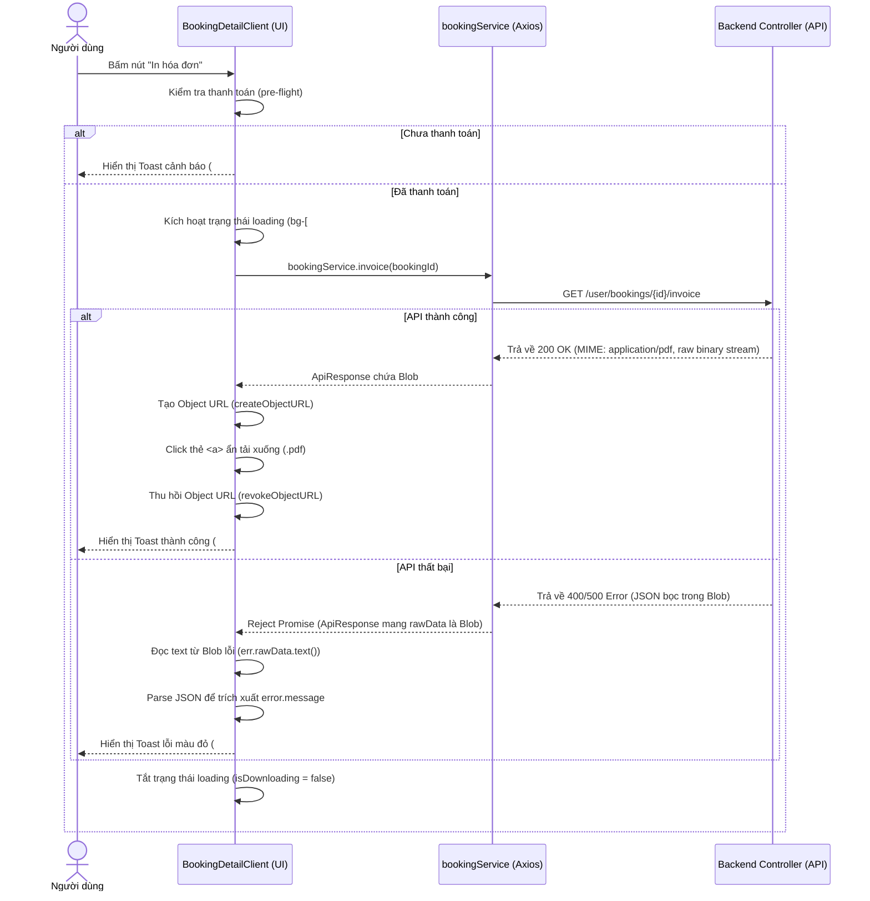

# Tích hợp Dữ liệu & Luồng API: Hóa đơn PDF (user-booking-invoice)

Tài liệu này đặc tả cơ chế tích hợp dữ liệu từ Backend API, thông qua Axios Client Service Layer, tới giao diện người dùng.

---

## 1. Dòng dữ liệu (Data Pipeline Flow)

Luồng hoạt động từ lúc nhấp chuột của người dùng đến khi lưu file PDF cục bộ:



---

## 2. Đặc tả Axios Client & Interceptor

### 2.1 Cấu hình responseType
Do kiểu dữ liệu nhận về là tệp nhị phân PDF, chúng ta cấu hình trực tiếp `responseType: "blob"` cho Axios Request:
```typescript
invoice: (id: number | string): Promise<ApiResponse<Blob>> =>
  axiosInstance.get(API_ENDPOINTS.BOOKINGS.INVOICE(id), { responseType: "blob" }),
```

### 2.2 Xử lý Lỗi đặc biệt với Interceptor
Vì responseType là `"blob"`, khi xảy ra lỗi ở server, Axios vẫn bọc lỗi JSON của server vào một đối tượng `Blob`. Do đó, `src/lib/axios.ts` đã được tùy chỉnh để gán `rawData: data` vào lỗi trả về, cho phép UI Component bắt được Blob thô này và giải nén thành text JSON:
```typescript
const errorResponse: ApiResponse & { rawData?: any } = {
  success: false,
  code: data?.code,
  error_key: data?.error_key,
  user_message: data?.user_message,
  errors: data?.errors,
  error: localizedMessage,
  message: localizedMessage,
  status,
  rawData: data, // Đối tượng Blob lỗi thô từ server
};
return Promise.reject(errorResponse);
```
