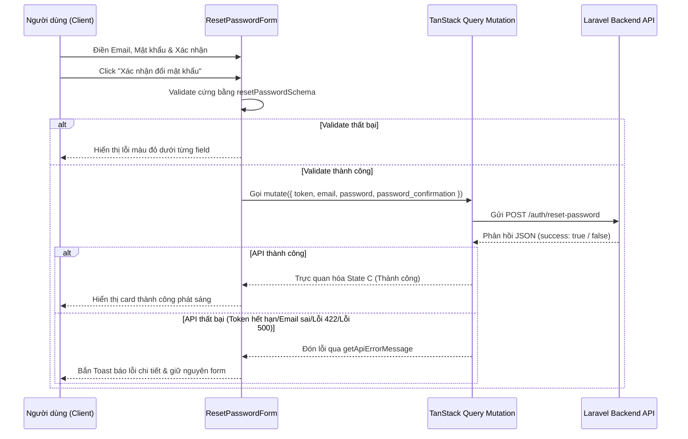

# Data Integration: Đặt lại mật khẩu (user-reset-password)

- **Feature Slug**: `user-reset-password`
- **Kết nối dữ liệu**: TanStack Query Mutation + Axios Service
- **Trạng thái**: **Đã hoàn thành kết nối dữ liệu API**

---

## 1. API Client Integration (Kết nối API)

Chúng ta sử dụng `authService.resetPassword` làm cầu nối gọi API chính thức:
- **Service file**: `src/services/auth.service.ts`
- **Chi tiết kết nối**:
  ```typescript
  resetPassword: (data: ResetPasswordRequest): Promise<ApiResponse<unknown>> =>
    axiosInstance.post(API_ENDPOINTS.AUTH.RESET_PASSWORD, data)
  ```
- **Hằng số Endpoint**: `/auth/reset-password` được khai báo tập trung trong `API_ENDPOINTS.AUTH.RESET_PASSWORD`.

---

## 2. TanStack Query Mutation Flow (Luồng Mutation)

Trong component `<ResetPasswordForm />`, cuộc gọi API được bọc trong một `useMutation` hook để tự động hóa việc quản lý trạng thái:

```typescript
const resetMutation = useMutation({
  mutationFn: (data: ResetPasswordRequest) => authService.resetPassword(data),
  onSuccess: (response) => {
    if (response.success) {
      setIsSuccess(true);
      toast.success(t("success.title"));
    } else {
      const errorMsg = getApiErrorMessage(response, t("failure.general_error"));
      toast.error(errorMsg);
    }
  },
  onError: (error) => {
    const errorMsg = getApiErrorMessage(error, t("failure.general_error"));
    toast.error(errorMsg);
  },
});
```

---

## 3. Data Flow Diagram (Sơ đồ luồng dữ liệu)



---

## 4. Key Performance Details (Chi tiết hiệu năng)

- **Tránh Spam Yêu cầu (Spam Prevention)**: Nút Submit tự động vô hiệu hóa (`disabled`) khi `resetMutation.isPending === true`, đồng thời hiển thị spinner xoay tròn để phản hồi ngay lập tức cho người dùng biết hệ thống đang xử lý, tránh gửi nhiều yêu cầu trùng lặp lên server.
- **Xử lý lỗi thông minh (Graceful Errors)**: Mọi lỗi trả về từ máy chủ (lỗi xác thực dữ liệu đầu vào Laravel 422, lỗi token 400, lỗi server 500) đều được bóc tách nội dung chi tiết bằng tiện ích `getApiErrorMessage(response)` của hệ thống để hiển thị thông điệp dễ hiểu nhất cho người dùng.
