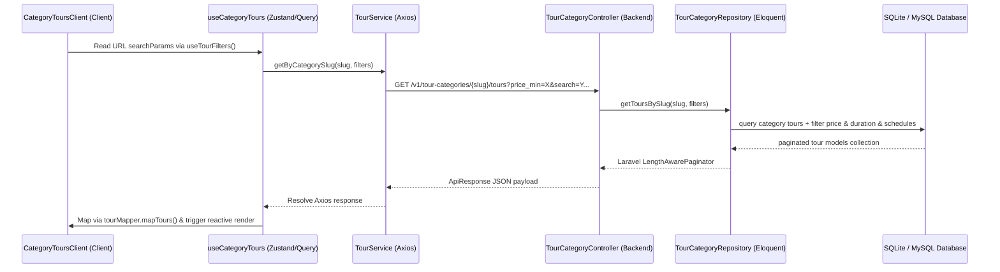

# Data Fetching & Query Integration: Tour theo Danh mục (user-tours-by-category)

- **Date**: 2026-05-24
- **Active Feature**: `user-tours-by-category`

---

## 1. Unified Query Wiring (Client to Server)
The data pipeline binds frontend states directly to backend SQL structures:

---

## 2. Parameter Scope Synchronization
All URL search parameters maps directly into query keys:
1. **Search**: `filters.search` -> Backend full-text / like keyword indexer.
2. **Price Range**: `filters.price_min` & `filters.price_max` -> Filtered on `price_adult` column.
3. **Duration**: `filters.duration` -> Matches duration labels like `1 ngày`, `2 ngày 1 đêm`.
4. **Departure Calendar**: `filters.available_from` & `filters.available_to` -> Queries underlying `TourSchedule` start dates.
5. **Sorting Options**: `sort_by` & `sort_order` -> Standard column sorting.
6. **Pagination**: `page` -> Dynamic page indexes.

---

## 3. Cache & Deduplication Layer
- **Query Key**: `["tour", "category", slug, params]`
- **Stale Time**: `5 minutes` (`5 * 60 * 1000`)
- **Deduplication benefits**: TanStack Query automatically aggregates identical overlapping requests. Even if components or triggers fire concurrently, only a single network query is dispatched to the backend, maximizing edge efficiency.
