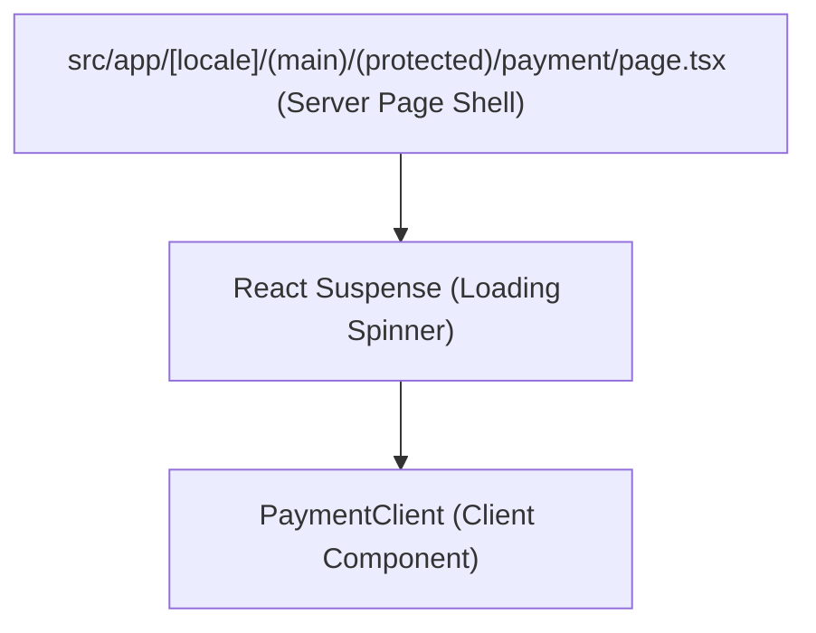

# Route Plan: Tour Payment

## 1. Scope & Strategy
- **Target Route Path:** `/payment`
- **Route Group:** `(protected)` inside `(main)`
  - *File Path:* `src/app/[locale]/(main)/(protected)/payment/page.tsx`
- **Authentication:** Chắc chắn được bảo vệ (Protected Route) bằng cả:
  - **Edge Middleware (`src/middleware.ts`):** Chứa `/payment` trong mảng `protectedRoutes`.
  - **Client-Side Wrapper (`src/app/[locale]/(main)/(protected)/layout.tsx`):** Tự động kiểm tra JWT tokens thông qua `useAuthStore` trước khi render Page, hiển thị Loading skeleton nếu chưa load xong.
- **i18n Namespace:** `tour` (Các bản dịch Payment nằm trong file `tour.json` ở key `"payment"`).

## 2. Server & Client Boundaries

- **Server-Side (Page Shell):**
  - Thực hiện khởi tạo và tạo `generateMetadata` cho SEO / Page title bằng cách đọc `tour.payment.title` qua `getTranslations({ namespace: 'tour' })`.
  - Bọc Client Component trong một `<Suspense>` boundary để xử lý `useSearchParams()` an toàn không block static-site generation (SSG) hoặc build phase.
- **Client-Heavy Flow (`PaymentClient`):**
  - Quản lý trạng thái hiển thị của checkout flow (Đang chờ thanh toán, Đã thành công, Thất bại, Đang chuyển hướng).
  - Tích hợp TanStack Query hooks để thực hiện:
    - Polling trạng thái thanh toán từ `/payments/status` thông qua `transaction_code`.
    - Lấy thông tin đơn hàng từ `/bookings/detail` thông qua `booking_code`.
    - Thực hiện Mutation thử lại thanh toán qua `/payments/retry`.

## 3. i18n & Route Config Updates
- **i18n Keys Added (Namespace: `tour`):**
  - `tour.payment.title`: Tiêu đề trang giao dịch
  - `tour.payment.status_pending`: Chờ thanh toán
  - `tour.payment.status_success`: Thanh toán thành công
  - `tour.payment.status_failed`: Thanh toán thất bại
  - `tour.payment.countdown_prefix`: Hoàn tất thanh toán trong...
  - `tour.payment.redirecting`: Đang chuyển hướng...
  - `tour.payment.retry`: Thử lại thanh toán
  - `tour.payment.cancel`: Hủy giao dịch
  - `tour.payment.view_booking`: Xem chi tiết đơn hàng
  - `tour.payment.transaction_info`: Thông tin giao dịch
  - `tour.payment.amount`: Số tiền
  - `tour.payment.method`: Phương thức
  - `tour.payment.booking_code`: Mã đơn hàng
- **Route Constants (`src/config/routes.ts`):**
  - Thêm `PAYMENT: "/payment"` vào danh sách `PROTECTED_ROUTES`.

## 4. Verification Plan
1. **Middleware Check:** Truy cập trực tiếp vào `http://localhost:3000/payment` mà không đăng nhập -> Phải redirect về `/login?callbackUrl=%2Fpayment`.
2. **Typecheck & Lint:**
   - Chạy lệnh `npm run typecheck` để đảm bảo không lỗi type.
   - Chạy lệnh `npm run lint` để đảm bảo code sạch.
3. **SSG/Prerender Check:** Đảm bảo `npm run build` thành công mà không gặp lỗi Suspense de-optimization khi dùng `useSearchParams()`.
