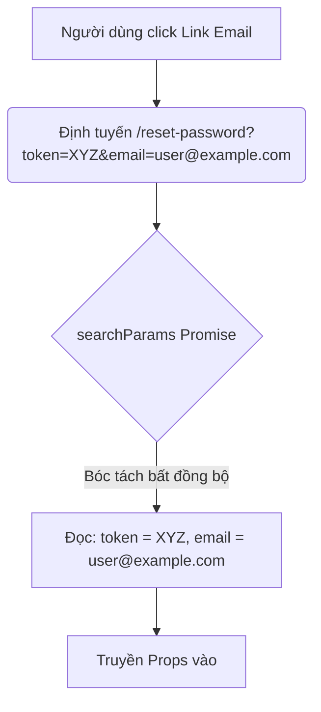

# Route Plan: Đặt lại mật khẩu (user-reset-password)

- **Feature Slug**: `user-reset-password`
- **Route UI**: `/reset-password` (hoặc `/[locale]/reset-password`)
- **Trạng thái**: **Đã hoàn thành cấu hình định tuyến**

---

## 1. Route Definition & Integration (Định nghĩa & Tích hợp)

Chúng ta đã thiết lập liên kết định tuyến đầy đủ tại các vị trí sau:

1. **Route Constant (`src/config/routes.ts`)**:
   - Thêm `RESET_PASSWORD: "/reset-password"` vào `AUTH_ROUTES`.
   - Kết quả: Có thể sử dụng `ROUTES.RESET_PASSWORD` trong toàn dự án một cách an toàn và tự động cập nhật nếu đường dẫn vật lý thay đổi.

2. **Next.js App Router Tree**:
   - Tạo mới tệp vật lý tại `src/app/[locale]/(auth)/reset-password/page.tsx`.
   - Cơ chế hoạt động:
     - Nhóm route `(auth)` giúp kế thừa layout chung của phân hệ Authentication.
     - Tham số động `[locale]` giúp `next-intl` xử lý đa ngôn ngữ tự động (ví dụ: `/vi/reset-password` hoặc `/en/reset-password`).
     - Đọc bất đồng bộ `token` và `email` từ `searchParams` (dạng Promise ở Next.js 15+) để truyền xuống cho client form.

---

## 2. i18n Route Configuration (Cấu hình i18n)

Để vượt qua bộ biên dịch nghiêm ngặt của Cloudflare Workers Edge runtime, chúng ta đã đăng ký tĩnh tài nguyên ngôn ngữ:
- Tạo mới: `src/messages/vi/reset-password.json` và `src/messages/en/reset-password.json`.
- Sửa đổi: `src/i18n/request.ts` để static import cả hai file trên và thêm namespace `resetPassword` vào registry toàn cục.
- Cấu hình này giúp `generateMetadata` và hook `useTranslations("resetPassword")` chạy trơn tru với hiệu năng tối đa.

---

## 3. Edge Middleware Access Control (Kiểm soát phân quyền)

Đã thêm `"/reset-password"` vào danh sách `authRoutes` tại `src/middleware.ts`:
- **Khách chưa đăng nhập (Guest)**: Truy cập hợp lệ để khôi phục mật khẩu.
- **Người dùng đã đăng nhập (Authenticated)**: Khi truy cập trang `/reset-password` (có cookie `token`), Edge Middleware sẽ tự động intercept và redirect người dùng về trang chủ `/` (hoặc `/en`) để ngăn chặn việc đặt lại mật khẩu không mong muốn.

---

## 4. URL Param Extraction Flow (Quy trình bóc tách URL)

Cấu hình định tuyến đã hoàn toàn khớp với thực tế và sẵn sàng cho việc thiết kế UI component!
